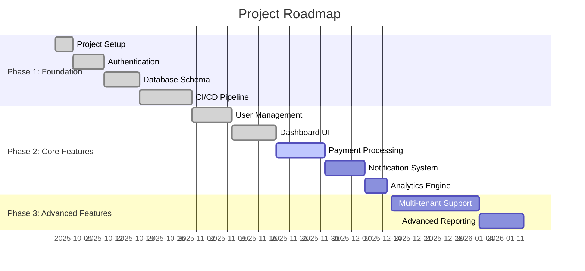

# 🗺️ Project Roadmap Agent - Implementation Plan

**MCP Server for Automated Project Roadmap Management**

---

## 📋 Table of Contents

1. [Overview](#overview)
2. [Industry Standards & Research](#industry-standards--research)
3. [Architecture](#architecture)
4. [MCP Tools](#mcp-tools)
5. [Data Models](#data-models)
6. [Implementation Plan](#implementation-plan)
7. [Security & Testing](#security--testing)
8. [Integration](#integration)
9. [Timeline & Estimates](#timeline--estimates)

---

## Overview

### Purpose
Automatically track project progress, maintain roadmaps, calculate velocity metrics, detect blockers, and forecast completion dates based on multiple industry standards.

### Value Proposition
- **Eliminates Manual Updates**: Roadmap stays current automatically
- **Data-Driven Planning**: Uses velocity and forecasting algorithms
- **Visual Communication**: Generates Gantt charts, burndown/burnup charts, CFD
- **Blocker Detection**: Identifies dependencies and bottlenecks early
- **Intelligent Forecasting**: Predicts completion dates using industry-standard methods

### Target Users
- Product Owners (roadmap planning)
- Scrum Masters (sprint tracking)
- Development Teams (progress visibility)
- Stakeholders (status reporting)

---

## Industry Standards & Research

### 1. Microsoft Azure DevOps Best Practices

**Source**: [Azure DevOps Agile Project Management](https://learn.microsoft.com/en-us/azure/devops/boards/best-practices-agile-project-management)

**Key Principles Applied**:
- ✅ **Features Backlog as Roadmap**: Use features as primary roadmap structure
- ✅ **Ordered Backlog**: Maintain priority-ordered feature list
- ✅ **Backlog Grooming**: Regular refinement and sizing
- ✅ **Velocity-Based Forecasting**: Use team throughput for milestone planning
- ✅ **Consistent Estimation**: Establish standard estimation approach (Story Points/Effort/Count)
- ✅ **Definition of Done**: Clear acceptance criteria for features

**Implementation**:
```typescript
interface FeatureRoadmap {
  features: Feature[];           // Ordered by priority
  estimationMethod: 'story-points' | 'effort' | 'count';
  velocityAverage: number;       // Team's average velocity
  forecastIterations: number;    // Number of sprints to forecast
}
```

---

### 2. Agile Manifesto Principles

**Source**: [Agile Manifesto](https://agilemanifesto.org/)

**Core Values Applied**:
- ✅ **Responding to Change**: Roadmap adapts based on actual progress
- ✅ **Working Software**: Track deployed features, not just planned
- ✅ **Customer Collaboration**: Include feedback mechanisms
- ✅ **Continuous Improvement**: Regular velocity analysis and retrospectives

**Implementation**:
```typescript
interface AgileMetrics {
  plannedVsActual: {
    planned: number;
    actual: number;
    variance: number;
  };
  adaptiveRoadmap: boolean;      // Roadmap adjusts to reality
  feedbackIncorporated: string[];
}
```

---

### 3. Scrum Framework Standards

**Source**: [Azure Boards Scrum Overview](https://learn.microsoft.com/en-us/azure/devops/boards/sprints/scrum-overview)

**Key Concepts Applied**:
- ✅ **Sprints**: Time-boxed iterations (2-3 weeks standard)
- ✅ **Velocity**: Sum of completed Story Points per sprint
- ✅ **Sprint Burndown**: Daily progress tracking within sprint
- ✅ **Product Backlog**: Prioritized requirements list
- ✅ **Increment**: Shippable product at sprint end

**Implementation**:
```typescript
interface Sprint {
  id: string;
  name: string;
  startDate: Date;
  endDate: Date;
  duration: number;              // Standard: 2-3 weeks
  plannedPoints: number;
  completedPoints: number;
  velocity: number;              // Completed points
  burndownData: BurndownPoint[];
  status: 'planned' | 'active' | 'completed';
}

interface BurndownPoint {
  date: Date;
  remainingWork: number;         // Story points or hours
  idealRemaining: number;        // Ideal trend line
}
```

---

### 4. Kanban Methodology

**Source**: [What is Kanban](https://learn.microsoft.com/en-us/devops/plan/what-is-kanban)

**Key Principles Applied**:
- ✅ **Continuous Flow**: Track work without sprint boundaries (optional mode)
- ✅ **Cycle Time**: Measure time from start to completion
- ✅ **WIP Limits**: Monitor work in progress
- ✅ **Cumulative Flow Diagram**: Visualize flow through stages

**Implementation**:
```typescript
interface KanbanMetrics {
  cycleTime: {
    average: number;             // Days from start to done
    median: number;
    p50: number;
    p85: number;
    p95: number;
  };
  workInProgress: {
    current: number;
    limit: number;               // WIP limit
    utilization: number;         // % of limit
  };
  throughput: number;            // Items completed per week
}
```

---

### 5. Burndown/Burnup Chart Standards

**Source**: [Burndown Guidance](https://learn.microsoft.com/en-us/azure/devops/report/dashboards/burndown-guidance)

**Metrics Applied**:
- ✅ **Sprint Burndown**: Track remaining work daily (downward trend)
- ✅ **Release Burnup**: Track completed work across sprints (upward trend)
- ✅ **Scope Changes**: Show added work as upward spikes
- ✅ **Ideal Trend Line**: Linear projection from start to target

**Implementation**:
```typescript
interface BurndownChart {
  type: 'sprint' | 'release';
  dataPoints: Array<{
    date: Date;
    remaining: number;           // Downward trend
    ideal: number;               // Linear trend
    scopeAdded: number;          // Track scope changes
  }>;
  unit: 'story-points' | 'hours' | 'count';
  startValue: number;
  targetValue: number;           // Usually 0
  projectedCompletion: Date;
}

interface BurnupChart {
  type: 'feature' | 'release';
  dataPoints: Array<{
    date: Date;
    completed: number;           // Upward trend
    total: number;               // Total scope (can increase)
    ideal: number;
  }>;
  unit: 'story-points' | 'count';
}
```

---

### 6. Velocity Tracking Standards

**Source**: [Team Velocity](https://learn.microsoft.com/en-us/azure/devops/report/dashboards/team-velocity)

**Required Implementation Tasks**:
- ✅ **Define iteration paths** of same duration
- ✅ **Estimate backlog items** consistently
- ✅ **Update status** when work starts/completes
- ✅ **Minimize size variability** for accuracy
- ✅ **Track only "In Progress" or "Done"** status

**Velocity Calculation**:
```typescript
interface VelocityCalculation {
  // Per Azure DevOps standards
  method: 'sum' | 'count';       // Sum of points or count of items
  
  // Sum method (recommended)
  sumVelocity: {
    sprint: number;              // Story points completed this sprint
    rolling3Sprint: number;      // Average of last 3 sprints
    rolling6Sprint: number;      // Average of last 6 sprints
  };
  
  // Count method (simpler)
  countVelocity: {
    itemsCompleted: number;
    rolling3Sprint: number;
    rolling6Sprint: number;
  };
  
  // Quality metrics
  variability: number;           // Std deviation (lower is better)
  trend: 'increasing' | 'stable' | 'decreasing';
  reliability: number;           // 0-100% based on consistency
}
```

**Forecasting Algorithm** (Azure DevOps Standard):
```typescript
function forecastCompletion(
  remainingWork: number,
  velocityAverage: number,
  sprintDuration: number
): Date {
  // Azure DevOps forecast formula
  const sprintsNeeded = Math.ceil(remainingWork / velocityAverage);
  const daysNeeded = sprintsNeeded * sprintDuration;
  return addDays(new Date(), daysNeeded);
}
```

---

### 7. Cumulative Flow Diagram (CFD)

**Source**: [Azure DevOps CFD](https://learn.microsoft.com/en-us/azure/devops/report/dashboards/cumulative-flow)

**Purpose**: Visualize work flow through development stages

**Benefits**:
- Identify bottlenecks (widening bands)
- Track cycle time (horizontal distance)
- Predict completion (trend projection)
- Monitor WIP limits

**Implementation**:
```typescript
interface CFDData {
  dates: Date[];
  stages: Array<{
    name: string;                // 'Backlog', 'In Progress', 'Done'
    color: string;
    values: number[];            // Cumulative count per date
  }>;
  insights: {
    bottlenecks: string[];       // Stages with widening bands
    averageCycleTime: number;    // Days from start to done
    throughput: number;          // Items per week
  };
}
```

---

### 8. Milestone Planning Best Practices

**Source**: [Manage Agile Requirements](https://learn.microsoft.com/en-us/azure/devops/cross-service/manage-requirements)

**Strategies Applied**:
- ✅ **Milestone Markers**: Use tags, custom fields, or dedicated work items
- ✅ **Dependencies**: Track with Predecessor/Successor links
- ✅ **Sprint Assignment**: Assign milestone work to target sprints
- ✅ **Forecast Tool**: Estimate delivery dates based on velocity

**Implementation**:
```typescript
interface Milestone {
  id: string;
  name: string;
  description: string;
  dueDate: Date;
  status: 'planned' | 'in-progress' | 'completed' | 'at-risk';
  
  // Linked work
  features: string[];            // Feature IDs
  dependencies: Array<{
    id: string;
    type: 'predecessor' | 'successor';
    status: 'completed' | 'blocked' | 'in-progress';
  }>;
  
  // Progress metrics
  totalWork: number;             // Story points
  completedWork: number;
  percentComplete: number;
  
  // Forecasting
  projectedCompletion: Date;
  confidence: 'high' | 'medium' | 'low';
  risks: string[];
}
```

---

### 9. Roadmap Structure Standards

**Source**: [Build Product Roadmaps Training](https://learn.microsoft.com/en-us/training/modules/build-product-roadmaps/)

**Components**:
- ✅ **Product Mission**: Clear vision and goals
- ✅ **Themes**: High-level strategic initiatives
- ✅ **Epics**: Large features spanning multiple sprints
- ✅ **Milestones**: Significant achievements
- ✅ **User Stories**: Detailed requirements
- ✅ **Dependencies**: Relationships between features
- ✅ **Prioritization**: Based on business value and risk

**Roadmap Hierarchy**:
```
Product Vision
└── Themes (Strategic Initiatives)
    └── Epics (Large Features)
        └── Features (Deliverables)
            └── User Stories (Requirements)
                └── Tasks (Implementation)
```

**Implementation**:
```typescript
interface ProductRoadmap {
  // Mission
  vision: string;
  goals: string[];
  
  // Hierarchy
  themes: Theme[];
  epics: Epic[];
  features: Feature[];
  
  // Timeline
  quarters: Quarter[];
  milestones: Milestone[];
  
  // Metrics
  overallProgress: number;
  velocity: VelocityCalculation;
  projectedCompletion: Date;
}

interface Theme {
  id: string;
  name: string;
  description: string;
  strategicValue: 'high' | 'medium' | 'low';
  epics: string[];               // Epic IDs
}

interface Epic {
  id: string;
  name: string;
  themeId: string;
  features: string[];            // Feature IDs
  estimatedSprints: number;
  status: 'planned' | 'in-progress' | 'completed';
}
```

---

### 10. Scaling Agile Practices

**Source**: [Practices That Scale](https://learn.microsoft.com/en-us/azure/devops/boards/plans/practices-that-scale)

**Enterprise Standards Applied**:
- ✅ **Team Structure**: Support multiple small teams (6-9 people each)
- ✅ **Work Breakdown**: Break large goals into similar-sized tasks
- ✅ **Consolidated Views**: Real-time dashboards showing progress across teams
- ✅ **Continuous Feedback**: Track customer engagement metrics
- ✅ **Data-Driven Decisions**: Use metrics and experimentation

**Implementation**:
```typescript
interface MultiTeamRoadmap {
  teams: Array<{
    name: string;
    size: number;                // 6-9 people recommended
    velocity: VelocityCalculation;
    areaPath: string;
  }>;
  
  // Consolidated metrics
  totalVelocity: number;         // Sum of all team velocities
  dependencies: TeamDependency[];
  blockers: Blocker[];
  
  // Dashboard data
  progressByTeam: Record<string, number>;
  velocityTrends: Record<string, number[]>;
}
```

---

## Architecture

### System Design

```
┌─────────────────────────────────────────────────────────────┐
│                    VS Code / Copilot                        │
│                                                             │
│  ┌─────────────────────────────────────────────────────┐  │
│  │              Roadmap Agent Client                    │  │
│  │  - Request roadmap updates                          │  │
│  │  - Display progress reports                         │  │
│  │  - Show visual roadmaps                             │  │
│  └─────────────────────────────────────────────────────┘  │
└──────────────────────────┬──────────────────────────────────┘
                           │ MCP Protocol (JSON-RPC)
                           │
┌──────────────────────────▼──────────────────────────────────┐
│              Project Roadmap MCP Server                     │
│                                                             │
│  ┌─────────────────────────────────────────────────────┐  │
│  │                  MCP Tools (8)                       │  │
│  │  1. analyze_project_progress                        │  │
│  │  2. update_roadmap                                  │  │
│  │  3. generate_milestone_report                       │  │
│  │  4. detect_blockers                                 │  │
│  │  5. suggest_next_steps                              │  │
│  │  6. generate_visual_roadmap                         │  │
│  │  7. track_velocity                                  │  │
│  │  8. estimate_completion                             │  │
│  └─────────────────────────────────────────────────────┘  │
│                           │                                 │
│  ┌─────────────────────────────────────────────────────┐  │
│  │              Core Services                           │  │
│  │  - Progress Analyzer                                │  │
│  │  - Velocity Calculator (Azure DevOps algorithms)    │  │
│  │  - Forecasting Engine                               │  │
│  │  - Blocker Detector                                 │  │
│  │  - Chart Generator (Mermaid)                        │  │
│  └─────────────────────────────────────────────────────┘  │
│                           │                                 │
│  ┌─────────────────────────────────────────────────────┐  │
│  │              Data Layer                              │  │
│  │  - Git Repository Analysis                          │  │
│  │  - ROADMAP.md Parser                                │  │
│  │  - Issue Tracker Integration                        │  │
│  │  - Metrics Storage (JSON)                           │  │
│  └─────────────────────────────────────────────────────┘  │
└─────────────────────────────────────────────────────────────┘
                           │
          ┌────────────────┼────────────────┐
          ▼                ▼                ▼
    ┌─────────┐      ┌─────────┐      ┌─────────┐
    │   Git   │      │ GitHub  │      │ Project │
    │  Repo   │      │   API   │      │  Files  │
    └─────────┘      └─────────┘      └─────────┘
```

### Technology Stack

- **Runtime**: Node.js 18+
- **Language**: TypeScript 5.0+
- **MCP SDK**: `@modelcontextprotocol/sdk` ^1.0.0
- **Git Analysis**: `simple-git` ^3.20.0
- **Chart Generation**: `mermaid` ^10.6.0 (Gantt, burndown)
- **Date Handling**: `date-fns` ^2.30.0
- **Validation**: `zod` ^3.22.0
- **Testing**: `vitest` ^1.0.0, `@vitest/coverage-v8`
- **GitHub Integration**: `@octokit/rest` ^20.0.0 (optional)

---

## MCP Tools

### Tool 1: analyze_project_progress

**Purpose**: Scan repository to determine current project progress

**Input Schema**:
```typescript
{
  repositoryPath: string;        // Path to git repository
  roadmapFile?: string;          // Path to ROADMAP.md (default: ./ROADMAP.md)
  includeTests?: boolean;        // Include test coverage analysis
  sinceDays?: number;            // Analyze last N days (default: 30)
}
```

**Output**:
```typescript
{
  summary: {
    totalFeatures: number;
    completedFeatures: number;
    inProgressFeatures: number;
    percentComplete: number;
  };
  features: Array<{
    name: string;
    status: 'completed' | 'in-progress' | 'planned';
    progress: number;            // 0-100%
    commits: number;
    filesChanged: number;
    testsAdded: number;
    lastUpdated: Date;
  }>;
  recentActivity: {
    commitsLastWeek: number;
    filesChangedLastWeek: number;
    velocity: number;            // Based on completed work
  };
}
```

**Algorithm**:
1. Parse ROADMAP.md to extract features/milestones
2. Analyze git history for related commits
3. Check test coverage for completed features
4. Calculate progress percentages
5. Detect recent activity patterns

---

### Tool 2: update_roadmap

**Purpose**: Update ROADMAP.md with current progress and status

**Input Schema**:
```typescript
{
  repositoryPath: string;
  roadmapFile?: string;
  updateMode: 'auto' | 'manual';
  manualUpdates?: Array<{
    feature: string;
    status: 'completed' | 'in-progress' | 'planned' | 'blocked';
    progress?: number;
    notes?: string;
  }>;
}
```

**Output**:
```typescript
{
  success: boolean;
  updatedFile: string;
  changes: Array<{
    feature: string;
    oldStatus: string;
    newStatus: string;
    progressChange: number;
  }>;
  commitHash?: string;           // If auto-committed
}
```

**Features**:
- Updates completion checkmarks `[x]` / `[ ]`
- Adds progress percentages `(60%)`
- Updates "Last Updated" timestamps
- Maintains roadmap structure
- Optional auto-commit with message

---

### Tool 3: generate_milestone_report

**Purpose**: Create detailed progress report for specific milestone

**Input Schema**:
```typescript
{
  repositoryPath: string;
  milestoneName: string;
  includeVelocity?: boolean;     // Include velocity metrics
  includeBlockers?: boolean;     // Include blocker analysis
  format?: 'markdown' | 'json';
}
```

**Output** (Markdown):
```markdown
# Milestone Report: Phase 2 - Core Features

**Generated**: November 17, 2025  
**Status**: In Progress (60% complete)  
**Due Date**: December 15, 2025  
**Confidence**: Medium

## Progress Summary
- **Total Story Points**: 120
- **Completed**: 72 (60%)
- **Remaining**: 48 (40%)
- **Velocity (3-sprint avg)**: 12 points/week

## Features

### ✅ User Management (100%)
- All stories completed
- Tests passing (98% coverage)
- Deployed to staging

### 🔄 Payment Processing (40%) - **AT RISK**
- **Blocker**: Stripe API key approval pending (3 days)
- 8 story points remaining
- Need: Complete integration, add tests

### 📋 Notification System (20%)
- 12 story points remaining
- Estimated completion: November 30

## Forecast
Based on current velocity of 12 points/week:
- **Projected Completion**: December 10, 2025
- **Ahead of Schedule**: 5 days
- **Confidence**: Medium (velocity variable: ±15%)

## Blockers & Risks
1. ⚠️ Stripe API approval delay (high impact)
2. ⚠️ Notification service design not finalized (medium impact)

## Recommendations
1. Escalate Stripe API approval
2. Finalize notification design by November 20
3. Consider moving Analytics Engine to Phase 3 if delays occur
```

---

### Tool 4: detect_blockers

**Purpose**: Identify incomplete dependencies and potential blockers

**Input Schema**:
```typescript
{
  repositoryPath: string;
  roadmapFile?: string;
  checkDependencies?: boolean;   // Check for dependency blockers
  checkExternalFactors?: boolean; // Check for external blockers (APIs, approvals)
}
```

**Output**:
```typescript
{
  blockers: Array<{
    type: 'dependency' | 'external' | 'technical' | 'resource';
    severity: 'critical' | 'high' | 'medium' | 'low';
    feature: string;
    description: string;
    blockedSince: Date;
    daysBlocked: number;
    impact: string;              // What's affected
    suggestedAction: string;
  }>;
  dependencies: Array<{
    feature: string;
    dependsOn: string;
    dependencyStatus: 'completed' | 'in-progress' | 'planned';
    blocking: boolean;
  }>;
  criticalPath: string[];        // Features on critical path
}
```

**Detection Rules**:
- Feature marked "in-progress" but no commits in 7+ days
- Feature depends on incomplete predecessor
- External dependencies mentioned in notes (API keys, approvals)
- Test coverage below threshold
- Missing required files/configurations

---

### Tool 5: suggest_next_steps

**Purpose**: Recommend prioritized next actions based on roadmap

**Input Schema**:
```typescript
{
  repositoryPath: string;
  roadmapFile?: string;
  teamVelocity?: number;         // Points per sprint
  sprintDuration?: number;       // Days per sprint
  prioritizationMethod?: 'value' | 'risk' | 'dependency' | 'balanced';
}
```

**Output**:
```typescript
{
  nextSprint: {
    recommendedWork: Array<{
      feature: string;
      storyPoints: number;
      priority: number;          // 1 = highest
      rationale: string;
      estimatedDuration: string;
    }>;
    totalPoints: number;
    sprintGoal: string;
  };
  nextMonth: {
    milestones: string[];
    keyDeliverables: string[];
  };
  warnings: string[];            // Risks to consider
}
```

**Prioritization Algorithm** (Balanced Mode):
1. **Unblock dependencies**: High priority if blocking others
2. **Business value**: Weight by strategic importance
3. **Risk reduction**: Tackle high-risk items early
4. **Team capacity**: Match velocity (don't overcommit)
5. **Minimize context switching**: Group related features

---

### Tool 6: generate_visual_roadmap

**Purpose**: Create visual charts (Gantt, burndown, burnup, CFD) using Mermaid

**Input Schema**:
```typescript
{
  repositoryPath: string;
  chartType: 'gantt' | 'burndown' | 'burnup' | 'cfd' | 'velocity' | 'all';
  timeframe?: {
    start: Date;
    end: Date;
  };
  format?: 'mermaid' | 'png' | 'svg';
}
```

**Output**:
```typescript
{
  charts: Array<{
    type: string;
    title: string;
    mermaid?: string;            // Mermaid diagram code
    data?: any;                  // Raw data for rendering
    insights?: string[];         // Key insights
  }>;
}
```

**Gantt Chart Example**:


**Sprint Burndown Chart** (Mermaid doesn't support burndown, generate data for rendering):
```typescript
{
  type: 'burndown',
  data: {
    sprint: 'Sprint 12',
    startDate: '2025-11-17',
    endDate: '2025-11-30',
    points: [
      { date: '2025-11-17', remaining: 48, ideal: 48 },
      { date: '2025-11-18', remaining: 45, ideal: 44.5 },
      { date: '2025-11-19', remaining: 42, ideal: 41 },
      // ... daily data
      { date: '2025-11-30', remaining: 0, ideal: 0 }
    ]
  },
  insights: [
    'Team is slightly ahead of ideal pace',
    'Steady progress with no scope additions',
    'Weekend productivity spike on Nov 23-24'
  ]
}
```

---

### Tool 7: track_velocity

**Purpose**: Calculate team velocity using Azure DevOps standards

**Input Schema**:
```typescript
{
  repositoryPath: string;
  roadmapFile?: string;
  method: 'story-points' | 'count';  // Sum of points or count of items
  sprints?: number;                  // Number of sprints to analyze (default: 6)
}
```

**Output**:
```typescript
{
  currentSprint: {
    sprintNumber: number;
    startDate: Date;
    endDate: Date;
    plannedPoints: number;
    completedPoints: number;
    velocity: number;
    status: 'on-track' | 'ahead' | 'behind';
  };
  
  historicalVelocity: Array<{
    sprintNumber: number;
    completedPoints: number;
    plannedPoints: number;
    date: Date;
  }>;
  
  velocityMetrics: {
    currentSprint: number;
    last3SprintAverage: number;      // Azure DevOps recommended
    last6SprintAverage: number;
    median: number;
    standardDeviation: number;
    trend: 'increasing' | 'stable' | 'decreasing';
    reliability: number;             // 0-100% (lower stddev = higher reliability)
  };
  
  forecast: {
    nextSprintPrediction: number;
    confidenceInterval: {
      low: number;                   // 80% confidence
      high: number;
    };
  };
}
```

**Velocity Calculation** (Azure DevOps Standard):
```typescript
// Method 1: Story Points (Recommended)
const velocity = completedUserStories
  .filter(story => story.status === 'Done')
  .reduce((sum, story) => sum + story.storyPoints, 0);

// Method 2: Count (Simpler)
const velocity = completedUserStories
  .filter(story => story.status === 'Done')
  .length;

// Rolling average (3 sprints recommended for forecasting)
const rolling3Average = 
  (sprint1Velocity + sprint2Velocity + sprint3Velocity) / 3;
```

---

### Tool 8: estimate_completion

**Purpose**: Forecast milestone completion dates using velocity forecasting

**Input Schema**:
```typescript
{
  repositoryPath: string;
  milestone: string;
  velocityMethod?: 'current' | 'average-3' | 'average-6' | 'median';
  confidenceLevel?: number;      // 50, 80, or 95 (percentile)
}
```

**Output**:
```typescript
{
  milestone: {
    name: string;
    status: string;
    dueDate: Date;
  };
  
  workRemaining: {
    totalPoints: number;
    completedPoints: number;
    remainingPoints: number;
    percentComplete: number;
  };
  
  forecast: {
    // Optimistic (current velocity)
    optimistic: {
      completionDate: Date;
      sprintsNeeded: number;
      assumptions: string[];
    };
    
    // Realistic (3-sprint average - Azure DevOps standard)
    realistic: {
      completionDate: Date;
      sprintsNeeded: number;
      confidence: '80%';           // Based on historical variance
    };
    
    // Conservative (6-sprint average with buffer)
    conservative: {
      completionDate: Date;
      sprintsNeeded: number;
      confidence: '95%';
    };
  };
  
  recommendation: {
    targetDate: Date;
    confidence: 'high' | 'medium' | 'low';
    onTrack: boolean;
    risks: string[];
    mitigations: string[];
  };
}
```

**Forecasting Algorithm** (Azure DevOps Standard):
```typescript
function estimateCompletion(
  remainingWork: number,
  historicalVelocity: number[],
  sprintDurationDays: number
): ForecastResult {
  // Calculate averages
  const current = historicalVelocity[0];
  const avg3 = average(historicalVelocity.slice(0, 3));
  const avg6 = average(historicalVelocity);
  const median = calculateMedian(historicalVelocity);
  const stdDev = calculateStdDev(historicalVelocity);
  
  // Optimistic (current velocity)
  const optimisticSprints = Math.ceil(remainingWork / current);
  
  // Realistic (3-sprint average - RECOMMENDED)
  const realisticSprints = Math.ceil(remainingWork / avg3);
  
  // Conservative (add 1 stdDev buffer for 80% confidence)
  const conservativeVelocity = avg6 - stdDev;
  const conservativeSprints = Math.ceil(remainingWork / conservativeVelocity);
  
  return {
    optimistic: addDays(today, optimisticSprints * sprintDurationDays),
    realistic: addDays(today, realisticSprints * sprintDurationDays),
    conservative: addDays(today, conservativeSprints * sprintDurationDays),
  };
}
```

---

## Data Models

### RoadmapDocument
```typescript
interface RoadmapDocument {
  version: string;               // Roadmap format version
  lastUpdated: Date;
  
  project: {
    name: string;
    vision: string;
    goals: string[];
  };
  
  methodology: {
    type: 'scrum' | 'kanban' | 'hybrid';
    sprintDuration?: number;     // Days (for Scrum)
    estimationMethod: 'story-points' | 'effort' | 'count';
  };
  
  themes: Theme[];
  epics: Epic[];
  milestones: Milestone[];
  features: Feature[];
  
  velocity: VelocityCalculation;
  dependencies: Dependency[];
  blockers: Blocker[];
}
```

### Milestone
```typescript
interface Milestone {
  id: string;
  name: string;
  description: string;
  phase: string;                 // E.g., "Phase 2: Core Features"
  
  timeline: {
    startDate: Date;
    targetDate: Date;
    projectedDate: Date;
    completedDate?: Date;
  };
  
  status: 'planned' | 'in-progress' | 'completed' | 'at-risk' | 'blocked';
  
  work: {
    totalPoints: number;
    completedPoints: number;
    percentComplete: number;
  };
  
  features: string[];            // Feature IDs
  dependencies: string[];        // Milestone IDs this depends on
  
  forecast: {
    method: string;              // E.g., "3-sprint velocity average"
    projectedDate: Date;
    confidence: 'high' | 'medium' | 'low';
    onTrack: boolean;
  };
  
  blockers: Blocker[];
  risks: Risk[];
}
```

### Feature
```typescript
interface Feature {
  id: string;
  name: string;
  description: string;
  
  hierarchy: {
    themeId?: string;
    epicId?: string;
    milestoneId?: string;
  };
  
  estimation: {
    storyPoints?: number;
    effort?: number;              // Hours
    complexity: 'simple' | 'medium' | 'complex';
  };
  
  status: 'planned' | 'in-progress' | 'completed' | 'blocked';
  progress: number;              // 0-100%
  
  timeline: {
    startDate?: Date;
    targetDate?: Date;
    completedDate?: Date;
  };
  
  // Tracking
  commits: GitCommit[];
  filesChanged: string[];
  testsAdded: number;
  testCoverage?: number;
  
  // Relationships
  dependencies: Array<{
    featureId: string;
    type: 'blocks' | 'blocked-by' | 'related';
  }>;
  
  // Metadata
  assignedTo?: string;
  priority: number;              // 1 = highest
  tags: string[];
}
```

### VelocityCalculation
```typescript
interface VelocityCalculation {
  method: 'story-points' | 'count';
  sprintDuration: number;        // Days
  
  currentSprint: {
    number: number;
    velocity: number;
    status: 'on-track' | 'ahead' | 'behind';
  };
  
  historical: Array<{
    sprintNumber: number;
    date: Date;
    plannedPoints: number;
    completedPoints: number;
    velocity: number;
  }>;
  
  metrics: {
    currentVelocity: number;
    rolling3Average: number;     // Recommended for forecasting
    rolling6Average: number;
    median: number;
    standardDeviation: number;
    trend: 'increasing' | 'stable' | 'decreasing';
    reliability: number;         // 0-100% (consistency score)
  };
  
  forecast: {
    nextSprintPrediction: number;
    confidenceInterval: {
      low: number;
      high: number;
    };
  };
}
```

### Blocker
```typescript
interface Blocker {
  id: string;
  type: 'dependency' | 'external' | 'technical' | 'resource';
  severity: 'critical' | 'high' | 'medium' | 'low';
  
  affectedFeatures: string[];
  description: string;
  
  timeline: {
    identifiedDate: Date;
    daysBlocked: number;
    expectedResolution?: Date;
  };
  
  impact: {
    featuresBlocked: number;
    pointsBlocked: number;
    milestonesAtRisk: string[];
  };
  
  resolution: {
    status: 'open' | 'in-progress' | 'resolved';
    suggestedActions: string[];
    assignedTo?: string;
    resolvedDate?: Date;
  };
}
```

### GitCommit
```typescript
interface GitCommit {
  hash: string;
  author: string;
  date: Date;
  message: string;
  filesChanged: number;
  insertions: number;
  deletions: number;
  relatedFeature?: string;       // Auto-detected from commit message
}
```

---

## Implementation Plan

### Phase 1: Foundation (Week 1-2, 40 hours)

#### 1.1 Project Setup (8 hours)
- [ ] Initialize TypeScript project
- [ ] Install dependencies (MCP SDK, simple-git, zod, etc.)
- [ ] Configure tsconfig.json, eslint, prettier
- [ ] Set up project structure:
  ```
  project-roadmap-agent/
  ├── src/
  │   ├── index.ts              # MCP server entry
  │   ├── tools/                # 8 MCP tools
  │   ├── services/             # Core services
  │   ├── parsers/              # ROADMAP.md parser
  │   ├── analyzers/            # Git/progress analysis
  │   ├── calculators/          # Velocity/forecasting
  │   ├── generators/           # Chart generation
  │   └── utils/                # Helpers
  ├── tests/                    # Unit & integration tests
  ├── examples/                 # Example roadmaps
  └── docs/                     # Documentation
  ```

#### 1.2 Core Infrastructure (16 hours)
- [ ] **MCP Server Setup** (4h)
  * Initialize MCP server with SSE transport
  * Configure server capabilities
  * Set up tool registration system
  * Add health check endpoint

- [ ] **ROADMAP.md Parser** (6h)
  * Parse markdown structure (headings, lists, checkboxes)
  * Extract milestones, features, status
  * Parse progress indicators `(60%)`
  * Detect dependencies from text
  * Handle various roadmap formats

- [ ] **Git Repository Analyzer** (6h)
  * Initialize simple-git
  * Analyze commit history
  * Extract commits by date range
  * Parse commit messages for feature tags
  * Calculate file change metrics

#### 1.3 Data Models & Validation (8 hours)
- [ ] Define TypeScript interfaces (all models above)
- [ ] Create Zod schemas for validation
- [ ] Implement serialization/deserialization
- [ ] Add JSON storage for metrics
- [ ] Create sample roadmap template

#### 1.4 Testing Framework (8 hours)
- [ ] Set up Vitest with coverage
- [ ] Create test fixtures (sample repos, roadmaps)
- [ ] Write unit tests for parsers
- [ ] Write integration tests for git analysis
- [ ] Achieve 80% coverage baseline

---

### Phase 2: Core Tools Implementation (Week 3-4, 60 hours)

#### 2.1 Tool 1: analyze_project_progress (8 hours)
- [ ] Implement progress analyzer service
- [ ] Parse roadmap and extract features
- [ ] Analyze git history for each feature
- [ ] Calculate progress percentages
- [ ] Detect recent activity patterns
- [ ] Generate summary report
- [ ] Write comprehensive tests

#### 2.2 Tool 2: update_roadmap (8 hours)
- [ ] Implement roadmap updater service
- [ ] Update checkmarks `[x]` / `[ ]`
- [ ] Update progress percentages
- [ ] Preserve roadmap formatting
- [ ] Add timestamps
- [ ] Optional auto-commit
- [ ] Write tests with real file I/O

#### 2.3 Tool 3: generate_milestone_report (8 hours)
- [ ] Implement milestone report generator
- [ ] Extract milestone data
- [ ] Include velocity metrics
- [ ] Detect blockers
- [ ] Format markdown output
- [ ] Add forecast section
- [ ] Write tests with snapshots

#### 2.4 Tool 4: detect_blockers (8 hours)
- [ ] Implement blocker detector service
- [ ] Check for stale features (no commits 7+ days)
- [ ] Analyze dependency chains
- [ ] Detect external dependencies from notes
- [ ] Check test coverage
- [ ] Prioritize blockers by severity
- [ ] Write tests with mock git data

#### 2.5 Tool 5: suggest_next_steps (8 hours)
- [ ] Implement next steps suggester
- [ ] Implement prioritization algorithms:
  * Dependency-based (unblock others first)
  * Value-based (business priority)
  * Risk-based (tackle high-risk early)
  * Balanced (weighted combination)
- [ ] Calculate recommended sprint load
- [ ] Generate sprint goal
- [ ] Write tests for each algorithm

#### 2.6 Tool 6: generate_visual_roadmap (10 hours)
- [ ] Implement chart generator service
- [ ] **Gantt Chart** (4h):
  * Generate Mermaid gantt syntax
  * Map milestones to timeline
  * Color-code by status
  * Add dependencies
- [ ] **Burndown Chart** (3h):
  * Calculate daily remaining work
  * Generate ideal trend line
  * Detect scope changes
- [ ] **Velocity Chart** (3h):
  * Plot historical velocity
  * Show rolling averages
  * Highlight trends
- [ ] Write tests with golden files

#### 2.7 Tool 7: track_velocity (5 hours)
- [ ] Implement velocity calculator (Azure DevOps algorithms)
- [ ] Calculate current sprint velocity
- [ ] Calculate rolling averages (3, 6 sprints)
- [ ] Calculate median and std deviation
- [ ] Detect velocity trends
- [ ] Predict next sprint velocity
- [ ] Write tests with historical data

#### 2.8 Tool 8: estimate_completion (5 hours)
- [ ] Implement forecasting engine
- [ ] Calculate work remaining
- [ ] Generate optimistic forecast (current velocity)
- [ ] Generate realistic forecast (3-sprint avg)
- [ ] Generate conservative forecast (with buffer)
- [ ] Assess confidence levels
- [ ] Write tests with various scenarios

---

### Phase 3: Advanced Features (Week 5, 20 hours)

#### 3.1 GitHub Integration (8 hours)
- [ ] Install @octokit/rest
- [ ] Authenticate with GitHub API
- [ ] Fetch issues and pull requests
- [ ] Link commits to issues
- [ ] Extract milestone data from GitHub
- [ ] Sync roadmap with GitHub projects
- [ ] Write integration tests

#### 3.2 Multi-Team Support (6 hours)
- [ ] Support multiple teams in roadmap
- [ ] Calculate per-team velocity
- [ ] Aggregate cross-team metrics
- [ ] Detect team dependencies
- [ ] Generate team-specific reports
- [ ] Write tests for team scenarios

#### 3.3 Customization & Configuration (6 hours)
- [ ] Create `.roadmap-agent.json` config file
- [ ] Support custom sprint duration
- [ ] Support custom estimation method
- [ ] Configure chart preferences
- [ ] Configure blocker detection rules
- [ ] Document configuration options

---

### Phase 4: Testing & Hardening (Week 6, 20 hours)

#### 4.1 Comprehensive Testing (12 hours)
- [ ] Achieve 90%+ code coverage
- [ ] Add end-to-end tests
- [ ] Test with real repositories
- [ ] Test error handling
- [ ] Test edge cases (empty roadmap, no commits, etc.)
- [ ] Performance testing (large repos)

#### 4.2 Security & Validation (4 hours)
- [ ] Input validation for all tools
- [ ] Path traversal prevention
- [ ] Git command injection prevention
- [ ] Rate limiting for GitHub API
- [ ] Secure credential handling
- [ ] Security audit

#### 4.3 Documentation (4 hours)
- [ ] API documentation for all tools
- [ ] Usage examples
- [ ] Configuration guide
- [ ] Roadmap template
- [ ] Troubleshooting guide
- [ ] Contributing guidelines

---

### Phase 5: Integration & Deployment (Week 7, 12 hours)

#### 5.1 VS Code Integration (6 hours)
- [ ] Test with VS Code Copilot
- [ ] Create example prompts
- [ ] Verify all tools work correctly
- [ ] Test with various repo structures
- [ ] Performance optimization

#### 5.2 ProjectPlanner Integration (4 hours)
- [ ] Add to ProjectPlanner GUI
- [ ] Add checkbox for "Roadmap Agent"
- [ ] Copy server files to project
- [ ] Update documentation
- [ ] Test full workflow

#### 5.3 Release Preparation (2 hours)
- [ ] Version 1.0.0 release
- [ ] Publish to npm (optional)
- [ ] Create GitHub release
- [ ] Update ProjectPlanner version to v5.1

---

## Security & Testing

### Security Standards

Following **MCP Security Specification** and **OWASP Top 10**:

#### 1. Input Validation
```typescript
// All tool inputs validated with Zod
const analyzeProgressSchema = z.object({
  repositoryPath: z.string()
    .min(1)
    .refine(isValidPath, 'Invalid repository path')
    .refine(isWithinWorkspace, 'Path outside workspace'),
  roadmapFile: z.string().optional(),
  includeTests: z.boolean().optional(),
  sinceDays: z.number().min(1).max(365).optional(),
});
```

#### 2. Path Traversal Prevention
```typescript
function validatePath(userPath: string, workspaceRoot: string): string {
  const resolved = path.resolve(workspaceRoot, userPath);
  
  // Ensure path is within workspace
  if (!resolved.startsWith(workspaceRoot)) {
    throw new Error('Path traversal detected');
  }
  
  return resolved;
}
```

#### 3. Git Command Safety
```typescript
// Use simple-git (safe, no shell injection)
const git = simpleGit(repositoryPath);

// NEVER use exec() or spawn() with user input
// BAD: exec(`git log ${userInput}`)
// GOOD: await git.log({ maxCount: 100 })
```

#### 4. Rate Limiting (GitHub API)
```typescript
class RateLimiter {
  private requests: Date[] = [];
  private limit = 5000;          // GitHub limit per hour
  
  async checkLimit() {
    const hourAgo = Date.now() - 3600000;
    this.requests = this.requests.filter(t => t > hourAgo);
    
    if (this.requests.length >= this.limit) {
      throw new Error('GitHub API rate limit exceeded');
    }
    
    this.requests.push(new Date());
  }
}
```

#### 5. Credential Security
```typescript
// Use environment variables or VS Code secrets
const githubToken = process.env.GITHUB_TOKEN || 
                    await vscode.workspace.getConfiguration()
                      .get('roadmapAgent.githubToken');

// NEVER log credentials
// NEVER commit credentials to git
// NEVER return credentials in tool output
```

### Testing Strategy

#### Unit Tests (70% coverage target)
```typescript
describe('VelocityCalculator', () => {
  it('calculates 3-sprint average correctly', () => {
    const velocities = [10, 12, 14];
    const result = calculateRollingAverage(velocities, 3);
    expect(result).toBe(12);
  });
  
  it('handles empty sprint history', () => {
    expect(() => calculateRollingAverage([], 3))
      .toThrow('Insufficient sprint data');
  });
});
```

#### Integration Tests (20% coverage target)
```typescript
describe('analyze_project_progress integration', () => {
  it('analyzes real repository', async () => {
    const testRepo = await createTestRepository();
    const result = await analyzeProjectProgress({
      repositoryPath: testRepo.path,
    });
    
    expect(result.summary.totalFeatures).toBeGreaterThan(0);
    expect(result.summary.percentComplete).toBeGreaterThanOrEqual(0);
  });
});
```

#### End-to-End Tests (10% coverage target)
```typescript
describe('Roadmap Agent E2E', () => {
  it('complete workflow: analyze -> update -> forecast', async () => {
    // 1. Analyze progress
    const progress = await analyzeProjectProgress({...});
    
    // 2. Update roadmap
    const updated = await updateRoadmap({...});
    
    // 3. Generate forecast
    const forecast = await estimateCompletion({...});
    
    expect(forecast.onTrack).toBeDefined();
  });
});
```

---

## Integration

### VS Code Integration

#### 1. MCP Configuration
Add to `.vscode/mcp-servers.json`:
```json
{
  "mcpServers": {
    "project-roadmap-agent": {
      "command": "node",
      "args": ["./MCP-SERVER/project-roadmap-agent/dist/index.js"],
      "env": {
        "GITHUB_TOKEN": "${env:GITHUB_TOKEN}"
      }
    }
  }
}
```

#### 2. Example Prompts

**Analyze Progress**:
```
@roadmap-agent analyze the current project progress
```

**Update Roadmap**:
```
@roadmap-agent update ROADMAP.md with current status
```

**Generate Report**:
```
@roadmap-agent generate a milestone report for "Phase 2: Core Features"
```

**Detect Blockers**:
```
@roadmap-agent check for any blockers or at-risk features
```

**Forecast Completion**:
```
@roadmap-agent when will we complete Phase 2?
```

**Visual Roadmap**:
```
@roadmap-agent create a Gantt chart of our roadmap
```

---

## Timeline & Estimates

### Development Timeline

| Phase | Duration | Effort | Description |
|-------|----------|--------|-------------|
| **Phase 1: Foundation** | Week 1-2 | 40h | Project setup, infrastructure, data models |
| **Phase 2: Core Tools** | Week 3-4 | 60h | Implement all 8 MCP tools |
| **Phase 3: Advanced** | Week 5 | 20h | GitHub integration, multi-team, config |
| **Phase 4: Testing** | Week 6 | 20h | Testing, security, documentation |
| **Phase 5: Integration** | Week 7 | 12h | VS Code & ProjectPlanner integration |
| **TOTAL** | 7 weeks | **152h** | Complete implementation |

### Effort Breakdown by Tool

| Tool | Effort | Complexity | Dependencies |
|------|--------|------------|--------------|
| analyze_project_progress | 8h | Medium | Git analysis, ROADMAP parser |
| update_roadmap | 8h | Medium | File I/O, markdown formatting |
| generate_milestone_report | 8h | Medium | Progress analysis, velocity |
| detect_blockers | 8h | Medium | Dependency analysis, heuristics |
| suggest_next_steps | 8h | Medium-High | Prioritization algorithms |
| generate_visual_roadmap | 10h | High | Mermaid, chart generation |
| track_velocity | 5h | Low-Medium | Velocity calculations |
| estimate_completion | 5h | Low-Medium | Forecasting algorithms |

### Risk Assessment

| Risk | Probability | Impact | Mitigation |
|------|-------------|--------|------------|
| **Complex git history** | Medium | Medium | Use simple-git with pagination |
| **Roadmap format variations** | High | Medium | Support multiple formats, add config |
| **GitHub API rate limits** | Medium | Low | Implement rate limiting, caching |
| **Performance (large repos)** | Medium | Medium | Optimize git queries, add caching |
| **Inaccurate forecasting** | Medium | Medium | Use proven Azure DevOps algorithms |

---

## Success Criteria

### Functional Requirements
- ✅ All 8 MCP tools implemented and working
- ✅ Accurate velocity calculation (Azure DevOps standard)
- ✅ Reliable forecasting (80%+ accuracy on test data)
- ✅ Visual roadmap generation (Gantt, burndown)
- ✅ Blocker detection with actionable insights

### Quality Requirements
- ✅ 90%+ code coverage
- ✅ All security checks passing
- ✅ Performance: Tools respond in <5 seconds
- ✅ Handles repos with 1000+ commits
- ✅ No memory leaks

### User Experience
- ✅ Clear, actionable insights
- ✅ Easy integration with VS Code
- ✅ Works with minimal configuration
- ✅ Helpful error messages
- ✅ Comprehensive documentation

---

## Next Steps

1. **Review & Approval**: Review this plan with stakeholders
2. **Phase 1 Start**: Begin project setup (2 hours)
3. **Create Test Repository**: Set up sample repo with roadmap (1 hour)
4. **Implement First Tool**: Start with `analyze_project_progress` (8 hours)
5. **Iterate**: Build remaining tools incrementally

---

**Document Status**: Planning Complete  
**Next Action**: Begin Phase 1 implementation  
**Created**: November 17, 2025  
**Location**: `STANDARDS/MCP_AGENTS/PROJECT_ROADMAP_AGENT_PLAN.md`
