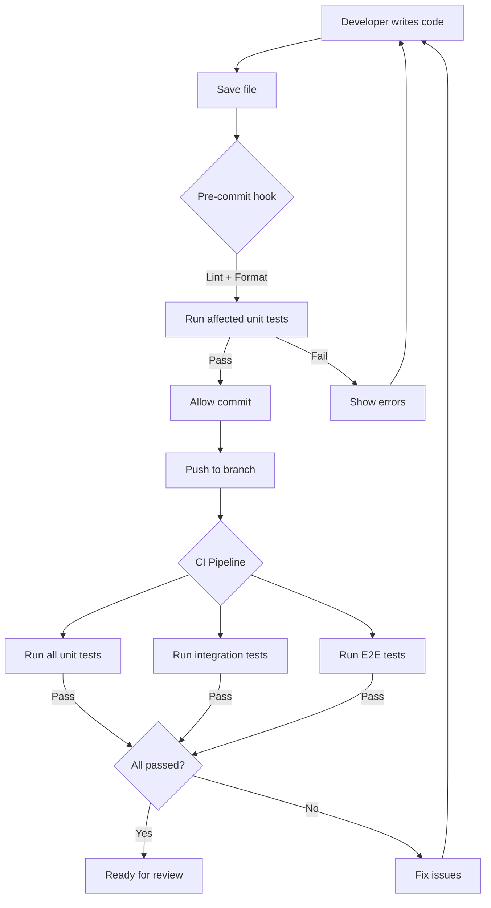
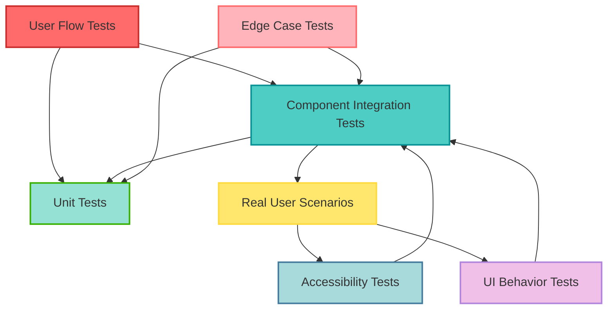

# Visual Testing Examples
## Diagrams, Flow Charts, and Visual Aids for Test Strategy

**Version:** 1.0  
**Updated:** December 2024  
**Purpose:** Provide visual representations of testing concepts, workflows, and architectures  
**Formats:** ASCII art, Mermaid diagrams, PlantUML (render with tools)

---

## Table of Contents

1. [Test Pyramid Diagrams](#test-pyramid-diagrams)
2. [Test Execution Workflows](#test-execution-workflows)
3. [CI/CD Pipeline Visualizations](#cicd-pipeline-visualizations)
4. [Test Coverage Reports](#test-coverage-reports)
5. [Test Category Relationships](#test-category-relationships)
6. [Testing Lifecycle](#testing-lifecycle)
7. [Test Data Flow](#test-data-flow)
8. [Test Organization Structure](#test-organization-structure)

---

## Test Pyramid Diagrams

### Classic Test Pyramid

```
                    /\
                   /  \
                  /    \
                 /  E2E \      ~10% - Slow, Expensive
                /  Tests \     • Full user journeys
               /          \    • Cross-browser
              /____________\   • Real integrations
             /              \
            /   Integration  \  ~30% - Medium Speed
           /      Tests       \ • API contracts
          /                    \• Service interactions
         /                      \• Component integration
        /________________________\
       /                          \
      /        Unit Tests          \ ~60% - Fast, Cheap
     /                              \• Pure functions
    /                                \• Business logic
   /                                  \• Isolated components
  /____________________________________\

```

**Key Principles:**
- **Base (Unit Tests):** Fast, isolated, test individual functions/components
- **Middle (Integration Tests):** Test how parts work together
- **Top (E2E Tests):** Slow, expensive, test complete user flows

### Testing Trophy (Modern Alternative)

```
                    /\
                   /  \
                  / E2E\      ~5% - Critical paths only
                 /______\
                /        \
               /  Integ.  \   ~50% - Majority of tests
              /   Tests    \  • Component integration
             /              \ • API interactions
            /                \• Real-ish environment
           /__________________\
          /                    \
         /    Unit Tests        \ ~35% - Supporting tests
        /                        \• Utilities
       /                          \• Pure functions
      /____________________________\
     /                              \
    /    Static Analysis/Linting    \ ~10% - Catch typos
   /        TypeScript, ESLint       \• Type errors
  /                                   \• Style issues
 /_____________________________________\

```

**Trophy Rationale:**
- Focus on integration tests (highest ROI)
- Fewer brittle E2E tests
- Static analysis catches basic errors early

### Meal Planner Test Pyramid Example

```
                    /\
                   /  \
                  / E2E\       15 tests
                 /______\      • Complete meal planning flow
                /        \     • Shopping list generation
               /   Comp   \    • Multi-day planning
              /Integration\   120 tests
             /    Tests    \  • Meal CRUD operations
            /              \ • Recipe search
           /                \• Ingredient calculations
          /__________________\
         /                    \
        /    Unit Tests        \ 265 tests
       /                        \• Date utilities
      /                          \• Price calculations
     /                            \• Validation functions
    /                              \• Data transformations
   /________________________________\

Total: 400 tests
Execution time: ~2 minutes locally, ~4 minutes CI
```

---

## Test Execution Workflows

### Local Development Flow



### CI/CD Test Pipeline

```
┌─────────────────────────────────────────────────────────────┐
│                    CODE PUSHED TO BRANCH                     │
└─────────────────────────────────────────────────────────────┘
                            │
                            ▼
┌─────────────────────────────────────────────────────────────┐
│  STAGE 1: Static Analysis (30 seconds)                      │
│  ├─ TypeScript compilation                                  │
│  ├─ ESLint checks                                           │
│  ├─ Prettier formatting                                     │
│  └─ Dependency audit                                        │
└─────────────────────────────────────────────────────────────┘
                            │
                    ┌───────┴───────┐
                    │               │
                    ▼               ▼
┌──────────────────────┐  ┌──────────────────────┐
│ STAGE 2A: Unit Tests │  │ STAGE 2B: Build      │
│ (1.5 minutes)        │  │ (1 minute)           │
│ ├─ 265 unit tests    │  │ ├─ Compile assets    │
│ ├─ Coverage: 85%+    │  │ ├─ Bundle code       │
│ └─ Fast feedback     │  │ └─ Optimize          │
└──────────────────────┘  └──────────────────────┘
                    │               │
                    └───────┬───────┘
                            │
                            ▼
┌─────────────────────────────────────────────────────────────┐
│  STAGE 3: Integration Tests (2 minutes)                     │
│  ├─ 120 integration tests                                   │
│  ├─ API contract tests                                      │
│  ├─ Database tests (test DB)                               │
│  └─ External service mocks                                  │
└─────────────────────────────────────────────────────────────┘
                            │
                            ▼
┌─────────────────────────────────────────────────────────────┐
│  STAGE 4: E2E Tests (3 minutes)                             │
│  ├─ 15 critical path tests                                  │
│  ├─ Chrome, Firefox, Safari                                 │
│  ├─ Desktop + Mobile viewports                              │
│  └─ Screenshots on failure                                  │
└─────────────────────────────────────────────────────────────┘
                            │
                    ┌───────┴───────┐
                    │               │
                    ▼               ▼
┌──────────────────────┐  ┌──────────────────────┐
│ STAGE 5A: A11y Tests │  │ STAGE 5B: Perf Tests │
│ (1 minute)           │  │ (2 minutes)          │
│ ├─ axe-core scans    │  │ ├─ Lighthouse        │
│ ├─ WCAG 2.1 AA       │  │ ├─ Bundle size       │
│ └─ Keyboard nav      │  │ └─ Load time         │
└──────────────────────┘  └──────────────────────┘
                    │               │
                    └───────┬───────┘
                            │
                            ▼
┌─────────────────────────────────────────────────────────────┐
│  STAGE 6: Security Scans (1 minute)                         │
│  ├─ npm audit                                               │
│  ├─ OWASP dependency check                                  │
│  └─ Code scanning (CodeQL)                                  │
└─────────────────────────────────────────────────────────────┘
                            │
                            ▼
┌─────────────────────────────────────────────────────────────┐
│                   ✅ ALL CHECKS PASSED                       │
│              Ready for merge to main branch                 │
└─────────────────────────────────────────────────────────────┘
                            │
                            ▼
                    [Deploy to Staging]
```

**Total Pipeline Time:** ~11 minutes  
**Parallelization:** Stages 2A/2B and 5A/5B run in parallel  
**Cost:** ~$0.05 per run on GitHub Actions

---

## CI/CD Pipeline Visualizations

### Pull Request Workflow

```
Developer Branch                Main Branch
─────────────────              ─────────────
      │                              │
      │ 1. Create PR                 │
      │─────────────────────────────>│
      │                              │
      │                         2. Trigger CI
      │                              │
      │                         ┌────▼────┐
      │                         │ Unit    │
      │                         │ Tests   │
      │                         └────┬────┘
      │                              │
      │                         ┌────▼────┐
      │                         │ Integ.  │
      │                         │ Tests   │
      │                         └────┬────┘
      │                              │
      │                         ┌────▼────┐
      │                         │  E2E    │
      │                         │ Tests   │
      │                         └────┬────┘
      │                              │
      │        3. Post results       │
      │<─────────────────────────────│
      │                              │
      │ 4. Code review               │
      │                              │
      │ 5. Approve + Merge           │
      │─────────────────────────────>│
      │                              │
      │                         6. Deploy
      │                         to Staging
      │                              │
      │                         7. Smoke Tests
      │                              │
      │                         ┌────▼────┐
      │                         │Production│
      │                         │ Deploy  │
      │                         └─────────┘
```

### Deployment Pipeline with Tests

```
┌──────────┐     ┌──────────┐     ┌──────────┐     ┌──────────┐
│   Dev    │────>│ Staging  │────>│   UAT    │────>│   Prod   │
│  Branch  │     │Environment│     │Environment│     │Environment│
└──────────┘     └──────────┘     └──────────┘     └──────────┘
     │                │                 │                 │
     │                │                 │                 │
     ▼                ▼                 ▼                 ▼
┌──────────┐     ┌──────────┐     ┌──────────┐     ┌──────────┐
│ PR Tests │     │Integration│     │  Manual  │     │  Smoke   │
│ • Unit   │     │ Tests     │     │  QA      │     │  Tests   │
│ • Lint   │     │ • E2E     │     │ • Explor.│     │ • Health │
│ • Format │     │ • A11y    │     │ • UAT    │     │ • Rollback│
└──────────┘     └──────────┘     └──────────┘     └──────────┘
                      │                                  │
                      │                                  │
                      └──────────┬───────────────────────┘
                                 │
                                 ▼
                         ┌───────────────┐
                         │  Monitoring   │
                         │ • Error rates │
                         │ • Performance │
                         │ • User metrics│
                         └───────────────┘
```

---

## Test Coverage Reports

### Coverage Report Example

```
----------------------------|---------|----------|---------|---------|
File                        | % Stmts | % Branch | % Funcs | % Lines |
----------------------------|---------|----------|---------|---------|
All files                   |   87.24 |    81.35 |   89.47 |   87.89 |
 src/                       |  100.00 |   100.00 |  100.00 |  100.00 |
  index.ts                  |  100.00 |   100.00 |  100.00 |  100.00 |
 src/components/            |   91.23 |    85.71 |   94.44 |   92.11 |
  MealCard.tsx              |   95.45 |    90.00 |  100.00 |   96.77 |
  MealList.tsx              |   88.89 |    83.33 |   88.89 |   89.47 |
  ShoppingList.tsx          |   90.00 |    84.62 |   95.00 |   91.30 |
 src/services/              |   82.14 |    76.47 |   85.71 |   83.33 |
  api.ts                    |   85.00 |    80.00 |   87.50 |   86.36 |
  storage.ts                |   78.26 |    72.22 |   83.33 |   79.17 |
 src/utils/                 |   96.67 |    92.31 |   98.00 |   97.14 |
  calculations.ts           |   98.00 |    95.00 |  100.00 |   98.57 |
  validation.ts             |   95.00 |    89.47 |   96.00 |   95.45 |
  date-helpers.ts           |   97.14 |    92.86 |   98.00 |   97.62 |
----------------------------|---------|----------|---------|---------|

Coverage thresholds:
  ✅ Statements: 87.24% (threshold: 80%)
  ✅ Branches:   81.35% (threshold: 70%)
  ✅ Functions:  89.47% (threshold: 80%)
  ✅ Lines:      87.89% (threshold: 80%)
```

### Coverage Visualization

```
Legend: 🟢 Excellent (90%+)  🟡 Good (70-89%)  🔴 Needs Work (<70%)

File Structure:
src/
├─ 🟢 index.ts (100%)
├─ components/
│  ├─ 🟢 MealCard.tsx (95%)
│  ├─ 🟡 MealList.tsx (89%)
│  └─ 🟢 ShoppingList.tsx (90%)
├─ services/
│  ├─ 🟡 api.ts (85%)
│  └─ 🟡 storage.ts (78%) ⚠️ Consider adding tests
├─ utils/
│  ├─ 🟢 calculations.ts (98%)
│  ├─ 🟢 validation.ts (95%)
│  └─ 🟢 date-helpers.ts (97%)
└─ hooks/
   ├─ 🔴 useMealPlan.ts (62%) ⚠️ NEEDS TESTS
   └─ 🟡 useShoppingList.ts (75%)

Priority: Add tests for useMealPlan.ts hook (critical business logic)
```

### Untested Code Hotspots

```
┌─────────────────────────────────────────────────────────┐
│  Files with Lowest Coverage (Action Required)           │
├─────────────────────────────────────────────────────────┤
│                                                          │
│  1. useMealPlan.ts                       62% 🔴         │
│     Missing: Error handling, edge cases                 │
│     Lines: 45-67, 89-102 (not covered)                  │
│     Priority: HIGH (core business logic)                │
│                                                          │
│  2. storage.ts                           78% 🟡         │
│     Missing: localStorage quota exceeded                │
│     Lines: 123-145 (not covered)                        │
│     Priority: MEDIUM (error scenarios)                  │
│                                                          │
│  3. auth.service.ts                      68% 🔴         │
│     Missing: Token refresh, logout                      │
│     Lines: 78-95, 110-125 (not covered)                 │
│     Priority: HIGH (security critical)                  │
│                                                          │
└─────────────────────────────────────────────────────────┘
```

---

## Test Category Relationships

### Test Category Dependency Map



### Test Execution Order

```
Phase 1: Foundation (Fast Feedback)
┌────────────────────────────────────┐
│ 1. Linting & Type Checking         │  ⚡ 30s
│    • Catch syntax errors early     │
└────────────────────────────────────┘
              │
              ▼
┌────────────────────────────────────┐
│ 2. Unit Tests                      │  ⚡ 1-2 min
│    • Pure functions                │
│    • Business logic                │
│    • Isolated components           │
└────────────────────────────────────┘
              │
              ▼
Phase 2: Integration (Medium Speed)
┌────────────────────────────────────┐
│ 3. Component Integration Tests     │  ⏱️ 2-3 min
│    • API calls                     │
│    • Service interactions          │
│    • State management              │
└────────────────────────────────────┘
              │
              ▼
┌────────────────────────────────────┐
│ 4. Edge Case & Boundary Tests      │  ⏱️ 1-2 min
│    • Error scenarios               │
│    • Limits & constraints          │
│    • Unusual inputs                │
└────────────────────────────────────┘
              │
              ▼
Phase 3: End-to-End (Slow, Thorough)
┌────────────────────────────────────┐
│ 5. User Flow Tests                 │  🐌 3-5 min
│    • Critical paths                │
│    • Complete journeys             │
│    • Real browser testing          │
└────────────────────────────────────┘
              │
              ▼
┌────────────────────────────────────┐
│ 6. Accessibility Tests             │  🐌 1-2 min
│    • axe-core scans                │
│    • Keyboard navigation           │
│    • Screen reader                 │
└────────────────────────────────────┘
              │
              ▼
┌────────────────────────────────────┐
│ 7. UI Behavior Tests               │  🐌 2-3 min
│    • Animations                    │
│    • Scrolling                     │
│    • Responsive design             │
└────────────────────────────────────┘
              │
              ▼
┌────────────────────────────────────┐
│ 8. Real User Scenarios (Optional)  │  🐌 5-10 min
│    • Customer workflows            │
│    • Production-like data          │
│    • Multi-session tests           │
└────────────────────────────────────┘

Total: 15-30 minutes (depending on scope)
```

---

## Testing Lifecycle

### Test-Driven Development (TDD) Cycle

```
        ┌─────────────┐
        │    START    │
        └──────┬──────┘
               │
               ▼
       ┌───────────────┐
       │  Write Test   │  🔴 Red Phase
       │  (Failing)    │  • Test what you want to build
       └───────┬───────┘  • Start with expected behavior
               │
               ▼
       ┌───────────────┐
       │  Run Test     │  ❌ Test fails (expected)
       │  (Fails)      │
       └───────┬───────┘
               │
               ▼
       ┌───────────────┐
       │ Write Code    │  🟢 Green Phase
       │ (Minimal)     │  • Write simplest code to pass
       └───────┬───────┘  • Don't over-engineer
               │
               ▼
       ┌───────────────┐
       │  Run Test     │  ✅ Test passes
       │  (Passes)     │
       └───────┬───────┘
               │
               ▼
       ┌───────────────┐
       │  Refactor     │  🔵 Refactor Phase
       │  Code         │  • Improve code quality
       └───────┬───────┘  • Tests keep passing
               │
               ▼
       ┌───────────────┐
       │  Run Tests    │  ✅ All tests pass
       │  Again        │
       └───────┬───────┘
               │
               ▼
         ┌─────┴─────┐
         │           │
         ▼           ▼
    New Feature?   Done
         │
         └──────> Loop back to "Write Test"
```

### AI-Driven Test Generation Workflow

```
┌─────────────────────────────────────────────────────────────┐
│  INPUT: Requirements, Features, User Stories                │
└────────────────────┬────────────────────────────────────────┘
                     │
                     ▼
┌─────────────────────────────────────────────────────────────┐
│  STEP 1: Analyze Requirements (AI)                          │
│  • Extract key features                                     │
│  • Identify user personas                                   │
│  • Map user flows                                           │
└────────────────────┬────────────────────────────────────────┘
                     │
                     ▼
┌─────────────────────────────────────────────────────────────┐
│  STEP 2: Generate Test Scenarios (AI)                       │
│  Persona 1: User                                            │
│    • Happy path scenarios                                   │
│    • Common error cases                                     │
│  Persona 2: QA Engineer                                     │
│    • Edge cases                                             │
│    • Boundary conditions                                    │
│  Persona 3: Developer                                       │
│    • Unit test cases                                        │
│    • Integration points                                     │
└────────────────────┬────────────────────────────────────────┘
                     │
                     ▼
┌─────────────────────────────────────────────────────────────┐
│  STEP 3: Prioritize Tests (AI + Human)                      │
│  🔴 Priority 1: Critical paths (must have)                  │
│  🟡 Priority 2: Common scenarios (should have)              │
│  🟢 Priority 3: Edge cases (nice to have)                   │
└────────────────────┬────────────────────────────────────────┘
                     │
                     ▼
┌─────────────────────────────────────────────────────────────┐
│  STEP 4: Generate Test Code (AI)                            │
│  • Select appropriate framework                             │
│  • Generate test boilerplate                                │
│  • Add assertions                                           │
│  • Include setup/teardown                                   │
└────────────────────┬────────────────────────────────────────┘
                     │
                     ▼
┌─────────────────────────────────────────────────────────────┐
│  STEP 5: Review & Refine (Human)                            │
│  • Verify test logic                                        │
│  • Add missing scenarios                                    │
│  • Adjust assertions                                        │
│  • Improve readability                                      │
└────────────────────┬────────────────────────────────────────┘
                     │
                     ▼
┌─────────────────────────────────────────────────────────────┐
│  STEP 6: Execute Tests                                      │
│  • Run test suite                                           │
│  • Collect results                                          │
│  • Analyze failures                                         │
└────────────────────┬────────────────────────────────────────┘
                     │
                     ▼
┌─────────────────────────────────────────────────────────────┐
│  OUTPUT: Comprehensive Test Suite                           │
│  • 50-500+ tests (based on project size)                    │
│  • Multiple test categories                                 │
│  • CI/CD ready                                              │
└─────────────────────────────────────────────────────────────┘
```

---

## Test Data Flow

### Test Data Architecture

```
┌──────────────────────────────────────────────────────────┐
│                    Test Data Sources                     │
└──────────────────────────────────────────────────────────┘
                            │
           ┌────────────────┼────────────────┐
           │                │                │
           ▼                ▼                ▼
    ┌──────────┐    ┌──────────┐    ┌──────────┐
    │  Static  │    │ Factory  │    │   Mock   │
    │  Fixtures│    │ Functions│    │   API    │
    └──────────┘    └──────────┘    └──────────┘
           │                │                │
           │                │                │
           └────────────────┼────────────────┘
                            │
                            ▼
           ┌────────────────────────────────┐
           │      Test Data Repository      │
           │  • Centralized data management │
           │  • Consistent across tests     │
           │  • Easy to update              │
           └────────────────┬───────────────┘
                            │
           ┌────────────────┼────────────────┐
           │                │                │
           ▼                ▼                ▼
    ┌──────────┐    ┌──────────┐    ┌──────────┐
    │   Unit   │    │  Integ.  │    │   E2E    │
    │  Tests   │    │  Tests   │    │  Tests   │
    └──────────┘    └──────────┘    └──────────┘
```

### Test Data Lifecycle

```
Setup Phase
───────────
┌─────────────────┐
│ beforeAll()     │  • Create test database
│                 │  • Seed common data
│                 │  • Initialize services
└────────┬────────┘
         │
         ▼
┌─────────────────┐
│ beforeEach()    │  • Reset database state
│                 │  • Create test user
│                 │  • Clear cache
└────────┬────────┘
         │
         ▼
Test Execution Phase
────────────────────
┌─────────────────┐
│ Test 1          │  • Use test data
│                 │  • Make assertions
│                 │  • Generate results
└────────┬────────┘
         │
         ▼
┌─────────────────┐
│ Test 2          │  • Fresh state from beforeEach
│                 │  • Isolated from Test 1
│                 │  • Independent execution
└────────┬────────┘
         │
         ▼
┌─────────────────┐
│ Test N          │  • Repeatable results
│                 │  • No side effects
│                 │  • Predictable behavior
└────────┬────────┘
         │
         ▼
Teardown Phase
──────────────
┌─────────────────┐
│ afterEach()     │  • Clean up test data
│                 │  • Reset mocks
│                 │  • Clear localStorage
└────────┬────────┘
         │
         ▼
┌─────────────────┐
│ afterAll()      │  • Close connections
│                 │  • Drop test database
│                 │  • Release resources
└─────────────────┘
```

---

## Test Organization Structure

### File Structure (Feature-Based)

```
project/
├── src/
│   ├── components/
│   │   ├── MealCard/
│   │   │   ├── MealCard.tsx
│   │   │   ├── MealCard.test.tsx        ← Unit tests
│   │   │   ├── MealCard.cy.tsx          ← Component tests
│   │   │   └── MealCard.stories.tsx     ← Storybook
│   │   │
│   │   └── ShoppingList/
│   │       ├── ShoppingList.tsx
│   │       ├── ShoppingList.test.tsx
│   │       └── ShoppingList.cy.tsx
│   │
│   ├── services/
│   │   ├── api/
│   │   │   ├── api.ts
│   │   │   ├── api.test.ts              ← Unit tests
│   │   │   └── api.integration.test.ts  ← Integration tests
│   │   │
│   │   └── storage/
│   │       ├── storage.ts
│   │       └── storage.test.ts
│   │
│   └── utils/
│       ├── calculations.ts
│       ├── calculations.test.ts
│       ├── validation.ts
│       └── validation.test.ts
│
├── tests/
│   ├── e2e/
│   │   ├── meal-planning.spec.ts        ← E2E tests
│   │   ├── shopping-list.spec.ts
│   │   └── user-auth.spec.ts
│   │
│   ├── integration/
│   │   ├── meal-plan-api.test.ts
│   │   └── recipe-search.test.ts
│   │
│   ├── fixtures/
│   │   ├── meals.json                   ← Test data
│   │   ├── recipes.json
│   │   └── users.json
│   │
│   ├── helpers/
│   │   ├── test-utils.ts                ← Test utilities
│   │   ├── mock-data.ts
│   │   └── render-with-providers.tsx
│   │
│   └── setup/
│       ├── jest.setup.ts                ← Global setup
│       └── test-db.ts
│
└── cypress/
    ├── e2e/
    │   ├── user-flows/
    │   │   └── meal-planning-flow.cy.ts
    │   └── accessibility/
    │       └── a11y-checks.cy.ts
    │
    ├── support/
    │   ├── commands.ts                  ← Custom commands
    │   └── e2e.ts
    │
    └── fixtures/
        └── test-data.json
```

### Test Suite Organization (Layer-Based)

```
┌─────────────────────────────────────────────────────────┐
│                     Test Suites                         │
└─────────────────────────────────────────────────────────┘

Unit Tests (Fast - Run frequently)
├─ utils/
│  ├─ calculations.test.ts (15 tests)
│  ├─ validation.test.ts (20 tests)
│  └─ date-helpers.test.ts (12 tests)
├─ components/ (React Testing Library)
│  ├─ MealCard.test.tsx (10 tests)
│  ├─ ShoppingList.test.tsx (15 tests)
│  └─ RecipeSearch.test.tsx (12 tests)
└─ services/
   ├─ api.test.ts (18 tests)
   └─ storage.test.ts (10 tests)

Integration Tests (Medium - Run on PR)
├─ api-contracts/
│  ├─ meal-plan-api.test.ts (25 tests)
│  ├─ recipe-api.test.ts (20 tests)
│  └─ user-api.test.ts (15 tests)
├─ component-integration/
│  ├─ meal-planning-workflow.test.tsx (18 tests)
│  └─ shopping-list-sync.test.tsx (12 tests)
└─ database/
   ├─ meal-operations.test.ts (20 tests)
   └─ user-data.test.ts (15 tests)

E2E Tests (Slow - Run on merge/deploy)
├─ critical-paths/
│  ├─ user-signup-login.spec.ts (8 tests)
│  ├─ create-meal-plan.spec.ts (10 tests)
│  └─ generate-shopping-list.spec.ts (7 tests)
├─ cross-browser/
│  ├─ meal-planning-chrome.spec.ts
│  ├─ meal-planning-firefox.spec.ts
│  └─ meal-planning-safari.spec.ts
└─ accessibility/
   ├─ keyboard-navigation.spec.ts (12 tests)
   └─ screen-reader.spec.ts (8 tests)

Total: 400+ tests across all layers
```

---

## Visual Test Results Dashboard

### Test Run Summary

```
╔══════════════════════════════════════════════════════════════╗
║              Test Run Summary - Build #1234                  ║
║                    December 2024                             ║
╠══════════════════════════════════════════════════════════════╣
║                                                              ║
║  Status: ✅ PASSED                                           ║
║  Duration: 11 minutes 34 seconds                             ║
║  Commit: a1b2c3d - "Add meal sharing feature"                ║
║  Branch: feature/meal-sharing                                ║
║  Triggered by: Pull Request #156                             ║
║                                                              ║
╠══════════════════════════════════════════════════════════════╣
║  Test Results                                                ║
╠══════════════════════════════════════════════════════════════╣
║                                                              ║
║  ✅ Unit Tests:        265/265 passed (100%)    1m 45s      ║
║  ✅ Integration Tests: 120/120 passed (100%)    2m 18s      ║
║  ✅ E2E Tests:          15/15 passed (100%)     4m 22s      ║
║  ✅ A11y Tests:         12/12 passed (100%)     1m 15s      ║
║  ✅ Performance:       Passed (all metrics OK)   1m 54s      ║
║                                                              ║
║  Total: 412/412 tests passed (100%)                          ║
║                                                              ║
╠══════════════════════════════════════════════════════════════╣
║  Coverage                                                    ║
╠══════════════════════════════════════════════════════════════╣
║                                                              ║
║  Statements: 87.24% ████████████████████░░░  (threshold: 80%)║
║  Branches:   81.35% ████████████████░░░░░░░  (threshold: 70%)║
║  Functions:  89.47% ████████████████████░░░  (threshold: 80%)║
║  Lines:      87.89% ████████████████████░░░  (threshold: 80%)║
║                                                              ║
╠══════════════════════════════════════════════════════════════╣
║  Quality Metrics                                             ║
╠══════════════════════════════════════════════════════════════╣
║                                                              ║
║  ✅ No accessibility violations                              ║
║  ✅ Lighthouse Score: 95/100                                 ║
║  ✅ Bundle Size: 245 KB (target: <300 KB)                    ║
║  ✅ No security vulnerabilities                              ║
║  ✅ Type Coverage: 100%                                      ║
║                                                              ║
╠══════════════════════════════════════════════════════════════╣
║  Next Steps                                                  ║
╠══════════════════════════════════════════════════════════════╣
║                                                              ║
║  🎉 All checks passed! Ready to merge.                       ║
║                                                              ║
╚══════════════════════════════════════════════════════════════╝
```

---

## Performance Comparison

### Test Execution Time (By Strategy)

```
No Tests (Baseline)
├─ Build time: 2 minutes
└─ Risk: HIGH (no safety net)

Minimal Tests (Unit Only)
├─ Build time: 4 minutes (+2 min)
├─ 265 unit tests
└─ Risk: MEDIUM (missing integration bugs)

Balanced Tests (Unit + Integration)
├─ Build time: 7 minutes (+5 min)
├─ 265 unit + 120 integration tests
└─ Risk: LOW-MEDIUM (missing E2E bugs)

Comprehensive Tests (Full Suite)
├─ Build time: 11 minutes (+9 min)
├─ 412 tests (unit + integration + E2E + a11y)
└─ Risk: VERY LOW (high confidence)

Over-Testing (Everything, Everywhere)
├─ Build time: 30+ minutes (+28 min)
├─ 1000+ tests (redundant coverage)
└─ Risk: Developer frustration, slow feedback

Recommendation: Balanced or Comprehensive (based on project criticality)
```

---

## How to Use These Visuals

1. **In Documentation:** Copy diagrams into your project README or wiki
2. **In Presentations:** Use for stakeholder meetings or team onboarding
3. **In CI/CD:** Refer to pipeline diagram when setting up automation
4. **In Planning:** Use Test Pyramid to guide test prioritization
5. **In Code Reviews:** Reference coverage reports to identify gaps

---

## Rendering Tools

### Mermaid Diagrams
- **GitHub/GitLab:** Renders automatically in Markdown
- **VS Code:** Install "Markdown Preview Mermaid Support" extension
- **Online:** https://mermaid.live

### PlantUML
- **Online:** https://www.plantuml.com/plantuml
- **VS Code:** Install "PlantUML" extension
- **CLI:** `plantuml diagram.puml`

### ASCII Art
- **Renders everywhere** (plaintext, markdown, code comments)
- **Tools:** asciiflow.com, monodraw.app

---

**Version:** 1.0  
**Created:** December 2024  
**Maintained by:** ProjectPlanner Repository  
**Next:** Refer to FRAMEWORK_SPECIFIC_EXAMPLES.md for code examples
