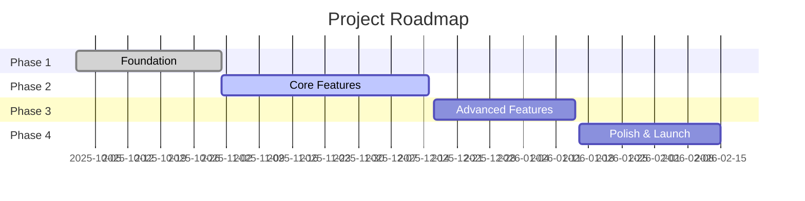

# 🚀 Future MCP Agent Ideas

**Potential agents to build for ProjectPlanner ecosystem**

---

## 🎯 Next Projects After ProjectPlanner Completion

> **User Priority Apps - To Build First**

### 1. 📺 Show Reminders App
**Type:** Personal Productivity App  
**Status:** Planned for post-ProjectPlanner  
**Priority:** User Priority #1

#### Description
A reminders application specifically designed for tracking TV shows, episodes, seasons, and viewing schedules.

#### Core Features
- Add shows with episode tracking
- Set reminders for new episodes
- Track watched vs. unwatched episodes
- Season/episode organization
- Air date notifications
- Streaming service integration (optional)

---

### 2. ⏰ Time-Based Preparation Reminder App
**Type:** Personal Productivity App  
**Status:** Planned for post-ProjectPlanner  
**Priority:** User Priority #2

#### Description
An intelligent reminder app that calculates when to start tasks based on how long they take and when they need to be completed.

#### Core Features
- Create task lists with time estimates
- Set deadline/target completion time
- Automatic calculation of start time
- Countdown notifications ("Start now to finish by 3pm")
- Multi-task preparation workflows
- Adjustment for buffer time/delays

#### Example Use Cases
- Getting ready for events/appointments
- Meal preparation timing
- Multi-step project preparation
- Morning/evening routines

---

## Agent Ideas

### 1. 💬 Code Documentation Agent
**Status:** Idea  
**Priority:** High  
**Complexity:** Medium

#### Problem
Developers constantly need to ask AI to add comments and documentation to code. This is repetitive and time-consuming.

#### Solution
An MCP agent that automatically:
- Analyzes code files for missing documentation
- Generates detailed inline comments explaining logic
- Creates JSDoc/TSDoc/docstring headers for functions/classes
- Adds README sections for modules
- Generates API documentation
- Maintains consistent documentation style

#### Tools
1. `analyze_code_documentation` - Scan files for missing/incomplete docs
2. `generate_inline_comments` - Add explanatory comments to code blocks
3. `generate_function_docs` - Create JSDoc/TSDoc/docstring headers
4. `generate_module_readme` - Create README for code modules
5. `update_api_docs` - Generate/update API documentation
6. `check_documentation_coverage` - Measure doc coverage %

#### Key Features
- **Smart context awareness**: Understands code patterns and generates meaningful comments (not obvious ones like `// increment i`)
- **Style consistency**: Learns project's documentation style
- **Incremental updates**: Only documents new/changed code
- **Multi-language support**: JavaScript, TypeScript, Python, C#, Java, etc.
- **Configurable verbosity**: Minimal, standard, or verbose comments
- **Git integration**: Auto-document on commit/PR

#### Example Usage
```typescript
// Before: Undocumented function
function processOrder(order, user) {
  const total = order.items.reduce((sum, item) => sum + item.price, 0);
  if (user.isPremium) total *= 0.9;
  return { ...order, total, processed: Date.now() };
}

// After: Agent adds comprehensive docs
/**
 * Processes an order by calculating the total price and applying discounts.
 * 
 * Iterates through all items in the order to sum their prices, then applies
 * a 10% premium member discount if applicable. Returns an enhanced order object
 * with the calculated total and processing timestamp.
 * 
 * @param {Order} order - The order object containing items array
 * @param {User} user - The user placing the order
 * @returns {ProcessedOrder} Order with total and processed timestamp
 */
function processOrder(order, user) {
  // Calculate sum of all item prices
  const total = order.items.reduce((sum, item) => sum + item.price, 0);
  
  // Apply 10% discount for premium members
  if (user.isPremium) total *= 0.9;
  
  // Return enhanced order with calculated total and processing time
  return { ...order, total, processed: Date.now() };
}
```

#### Implementation Estimate
- **Time**: 20-25 hours
- **Complexity**: Medium (requires AST parsing, code analysis)
- **Dependencies**: Tree-sitter, JSDoc, TSDoc, language parsers

---

### 2. 🗺️ Project Roadmap Agent
**Status:** Idea  
**Priority:** High  
**Complexity:** Medium-High

#### Industry Standards & Best Practices

This agent is based on **multiple industry standards** for Agile project management, product roadmapping, and DevOps practices:

##### **1. Microsoft Azure DevOps Best Practices**
- **Source**: [Azure DevOps Agile Project Management](https://learn.microsoft.com/en-us/azure/devops/boards/best-practices-agile-project-management)
- **Key Principles**:
  * Use Features backlog as product roadmap
  * Order and refine features regularly (backlog grooming)
  * Size requirements to fit within iterations
  * Use Forecast tool with team velocity for milestone planning
  * Track velocity based on completed work (story points or count)
  * Maintain clear acceptance criteria and definition of done

##### **2. Agile Manifesto Principles**
- **Iterative Planning**: Respond to change over following a plan
- **Continuous Delivery**: Deliver working software frequently
- **Collaboration**: Business and developers work together daily
- **Reflection**: Regular retrospectives to adjust and improve

##### **3. Scrum Framework Standards**
- **Source**: [Azure Boards Scrum Overview](https://learn.microsoft.com/en-us/azure/devops/boards/sprints/scrum-overview)
- **Key Concepts**:
  * **Sprints**: Time-boxed iterations (2-3 weeks)
  * **Velocity**: Amount of work completed per sprint
  * **Sprint Burndown**: Track progress within sprint
  * **Product Backlog**: Prioritized list of features/requirements
  * **Scrum Roles**: Product Owner (prioritization), Scrum Master (facilitation)

##### **4. Kanban Methodology**
- **Source**: [What is Kanban](https://learn.microsoft.com/en-us/devops/plan/what-is-kanban)
- **Key Principles**:
  * **Continuous Flow**: No fixed sprints, continuous delivery
  * **Cycle Time**: Time from start to completion
  * **WIP Limits**: Limit work in progress
  * **Visual Board**: Kanban board with workflow stages

##### **5. Burndown/Burnup Chart Standards**
- **Source**: [Burndown Guidance](https://learn.microsoft.com/en-us/azure/devops/report/dashboards/burndown-guidance)
- **Metrics**:
  * **Burndown**: Tracks remaining work over time (downward trend)
  * **Burnup**: Tracks completed work over time (upward trend)
  * **Sprint Burndown**: Daily progress within sprint
  * **Release Burndown**: Progress across multiple sprints

##### **6. Velocity Tracking Standards**
- **Source**: [Team Velocity](https://learn.microsoft.com/en-us/azure/devops/report/dashboards/team-velocity)
- **Required Tasks**:
  * Define iteration paths (sprints) of same duration
  * Estimate backlog items consistently
  * Update status when work starts/completes
  * Minimize size variability for accuracy
  * Track only work with "In Progress" or "Done" status
- **Calculation**: Sum of Story Points/Size/Effort completed per sprint

##### **7. Cumulative Flow Diagram (CFD)**
- **Purpose**: Visualize work flow through development stages
- **Benefits**: Identify bottlenecks, track cycle time, predict completion

##### **8. Milestone Planning Best Practices**
- **Source**: [Manage Agile Requirements](https://learn.microsoft.com/en-us/azure/devops/cross-service/manage-requirements)
- **Strategies**:
  * Use milestone markers (tags, custom fields, or work items)
  * Link dependencies with Predecessor/Successor relationships
  * Assign milestone work to target sprints
  * Use Forecast tool to estimate delivery dates

##### **9. Roadmap Structure Standards**
- **Source**: [Build Product Roadmaps Training](https://learn.microsoft.com/en-us/training/modules/build-product-roadmaps/)
- **Components**:
  * **Product Mission**: Clear vision and goals
  * **Themes**: High-level strategic initiatives
  * **Epics**: Large features spanning multiple sprints
  * **Milestones**: Significant achievements or deliverables
  * **User Stories**: Detailed requirements
  * **Dependencies**: Relationships between features
  * **Prioritization**: Based on business value and risk

##### **10. Scaling Agile Practices**
- **Source**: [Practices That Scale](https://learn.microsoft.com/en-us/azure/devops/boards/plans/practices-that-scale)
- **Enterprise Standards**:
  * **Team Structure**: Small autonomous teams (6-9 people)
  * **Work Breakdown**: Break large goals into similar-sized tasks
  * **Consolidated Views**: Real-time dashboards showing progress
  * **Continuous Feedback**: Customer engagement throughout lifecycle
  * **Data-Driven Decisions**: Use metrics and experimentation

#### Problem
Projects evolve rapidly, and roadmaps quickly become outdated. Manually tracking progress, updating milestones, and maintaining roadmap documents is tedious.

#### Solution
An MCP agent that automatically:
- Tracks project milestones and progress
- Updates roadmap based on completed features
- Identifies blockers and dependencies
- Generates visual roadmaps (Gantt charts, timelines, burndown charts)
- Calculates team velocity using industry-standard methods
- Forecasts completion dates based on historical velocity
- Integrates with git commits, issues, PRs
- Follows Azure DevOps and Agile best practices

#### Tools
1. `analyze_project_progress` - Scan commits, files, tests to determine completion
2. `update_roadmap` - Update ROADMAP.md with current status following Azure DevOps structure
3. `generate_milestone_report` - Create progress reports with velocity metrics
4. `detect_blockers` - Identify incomplete dependencies and bottlenecks
5. `suggest_next_steps` - Recommend priorities using forecasting algorithms
6. `generate_visual_roadmap` - Create Mermaid Gantt charts, burndown/burnup charts, CFD
7. `track_velocity` - Calculate velocity using story points/count (Azure DevOps standard)
8. `estimate_completion` - Predict milestone completion using velocity forecasting

#### Key Features
- **Automated progress tracking**: Uses git commits, test coverage, file changes
- **Dependency mapping**: Understands feature dependencies
- **Blocker detection**: Identifies incomplete prerequisites
- **Visual generation**: Creates Gantt charts, timelines, burndown charts
- **Velocity tracking**: Measures and predicts completion rates
- **Issue integration**: Links to GitHub/GitLab issues
- **AI-assisted planning**: Suggests realistic next steps

#### Example Roadmap Structure
```markdown
# Project Roadmap

## Overview
**Current Phase:** Phase 2 - Core Features (60% complete)  
**Estimated Completion:** December 15, 2025  
**Velocity:** 12 story points/week

## Milestones

### ✅ Phase 1: Foundation (100%) - Completed Nov 1, 2025
- [x] Project setup
- [x] Basic authentication
- [x] Database schema
- [x] CI/CD pipeline

### 🔄 Phase 2: Core Features (60%) - In Progress
- [x] User management (100%)
- [x] Dashboard UI (100%)
- [ ] Payment processing (40%) - **BLOCKER: Stripe API integration**
- [ ] Notification system (20%)
- [ ] Analytics engine (0%)

**Next Steps (Prioritized):**
1. Complete Stripe API integration (8h remaining)
2. Finish notification system (12h remaining)
3. Start analytics engine (20h estimated)

### 📋 Phase 3: Advanced Features (0%) - Planned for Dec 16
- [ ] Multi-tenant support
- [ ] Advanced reporting
- [ ] API v2
- [ ] Mobile app

### 🎯 Phase 4: Polish & Launch (0%) - Planned for Jan 2026
- [ ] Performance optimization
- [ ] Security audit
- [ ] Documentation
- [ ] Marketing site
- [ ] Beta launch

## Dependencies
- Payment processing → Analytics engine
- Multi-tenant support → Advanced reporting
- All Phase 3 features → Phase 4 launch

## Blockers
⚠️ **Payment processing**: Stripe API key approval pending (waiting 3 days)
⚠️ **Analytics engine**: Need data schema finalized

## Velocity Trends
- Week of Nov 4: 10 story points
- Week of Nov 11: 14 story points
- Week of Nov 18: 12 story points (projected)
- **Average**: 12 points/week

## Visual Roadmap

```

#### Implementation Estimate
- **Time**: 30-35 hours
- **Complexity**: Medium-High (requires git analysis, progress tracking, visualization)
- **Dependencies**: simple-git, mermaid, GitHub API, date-fns

---

### 3. 📝 Context Summary Agent (Already Planned!)
**Status:** Designed (see DOCUMENTATION_AGENT_PLAN.md)  
**Priority:** High  
**Complexity:** Medium

See `STANDARDS/MCP_AGENTS/DOCUMENTATION_AGENT_PLAN.md` for complete design.

---

## Additional Agent Ideas

### 4. 🔒 Security Audit Agent
- Scan code for vulnerabilities
- Check dependencies for CVEs
- Validate security best practices
- Generate security reports
- Suggest fixes

### 5. 🎨 UI/UX Review Agent
- Analyze UI components against design standards
- Check accessibility (WCAG compliance)
- Suggest UX improvements
- Validate responsive design
- Generate design system compliance reports

### 6. 🧪 Test Gap Detector Agent
- Analyze code coverage
- Identify untested code paths
- Suggest missing test cases
- Generate test stubs
- Track testing progress

### 7. 📊 Performance Monitoring Agent
- Track bundle sizes
- Monitor load times
- Detect performance regressions
- Suggest optimizations
- Generate performance reports

### 8. 🔄 Refactoring Suggestion Agent
- Detect code smells
- Suggest refactoring opportunities
- Identify duplicate code
- Recommend design patterns
- Track technical debt

---

## Implementation Priority

| Agent | Priority | Complexity | Estimated Effort | Dependencies |
|-------|----------|------------|------------------|--------------|
| **Documentation Agent** | 🔥 High | Medium | 20-25h | Tree-sitter, JSDoc |
| **Roadmap Agent** | 🔥 High | Medium-High | 30-35h | simple-git, mermaid |
| **Context Summary** | 🔥 High | Medium | 17h | Already designed |
| Security Audit | Medium | High | 35-40h | OWASP tools, scanners |
| UI/UX Review | Medium | Medium | 25-30h | Puppeteer, axe-core |
| Test Gap Detector | Medium | Medium | 20-25h | Coverage tools |
| Performance Monitor | Low | Medium-High | 30-35h | Lighthouse, webpack |
| Refactoring Suggestions | Low | High | 40-45h | AST analysis, ML |

---

## Next Steps

1. **Complete Context Summary Agent** (Phase 2-4 from implementation plan)
2. **Build Documentation Agent** (solves immediate pain point)
3. **Build Roadmap Agent** (keeps project organized)
4. **Evaluate other agents** based on user feedback

---

**Created:** November 16, 2025  
**Status:** Brainstorming  
**Location:** ProjectPlanner/PLANNING/FUTURE_AGENT_IDEAS.md
